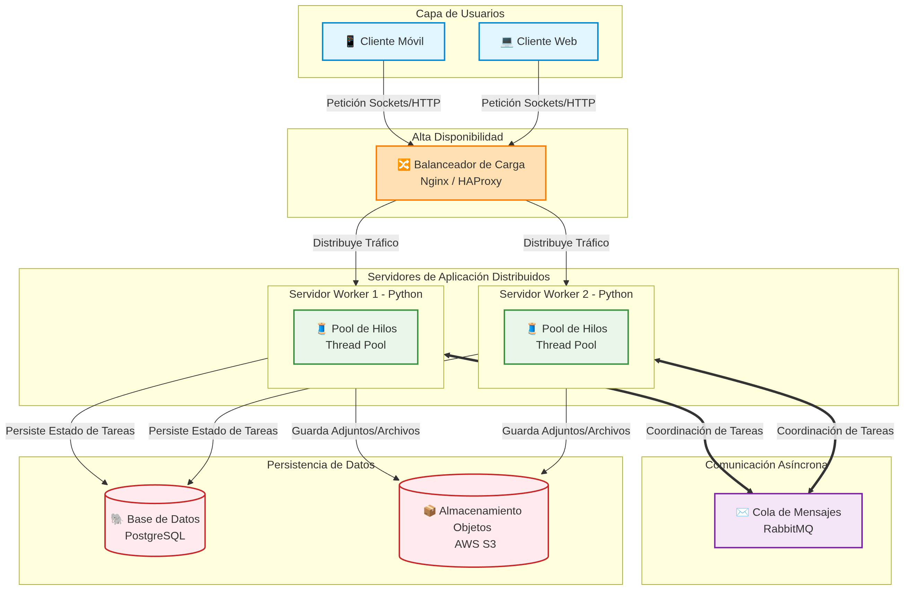
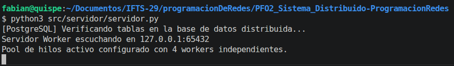
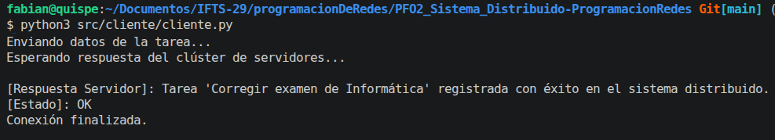

# PFO 3: Rediseño como Sistema Distribuido (Cliente-Servidor)

Este proyecto implementa la arquitectura de un sistema de gestión de tareas distribuido y escalable utilizando sockets puros en Python y concurrencia por medio de Pools de Hilos.

## Arquitectura del Sistema
El diagrama de arquitectura diseñado se encuentra en la carpeta `docs/arquitectura.png` y detalla el flujo completo desde los clientes, pasando por el balanceador de carga, hasta los servidores workers y el almacenamiento distribuido.



## Simulación del Almacenamiento y Componentes Distribuidos
Para cumplir con los objetivos prácticos del diseño de redes sin requerir infraestructura en la nube compleja, los componentes de almacenamiento y mensajería se manejan mediante **simulación intermedia y logs semánticos**:
* **PostgreSQL:** Simulado localmente a través del motor relacional **SQLite** (`tareas_distribuidas.db`). El código realiza persistencia real en tablas estructuradas informando las transacciones de manera lógica como si operase sobre Postgres.
* **AWS S3:** Simulado a través del directorio local `src/servidor/storage/`. Cuando el cliente transmite un archivo, el servidor procesa el flujo binario y lo almacena físicamente en el disco.
* **RabbitMQ:** Simulado mediante eventos traza en consola, demostrando la coordinación asíncrona entre las colas y los procesos trabajadores.
* **Pool de Hilos:** Implementado de manera nativa mediante `concurrent.futures.ThreadPoolExecutor` en el servidor backend para dar soporte de concurrencia a los hilos de ejecución (*Workers*).

## Cómo ejecutar el proyecto

1. Corre el servidor para que empiece a escuchar conexiones de red:
   ```bash
   python src/servidor/servidor.py
   ```

2. En otra terminal (sin cerrar la anterior), ejecuta el script del cliente para inyectar una tarea con un archivo simulado en el sistema distribuido:

   ```bash
   python src/cliente/cliente.py
   ```

### 📸 Capturas de la Ejecución

A continuación se detalla cómo se visualiza el sistema distribuido en funcionamiento continuo:

#### Servidor (Procesamiento y Workers)
Muestra la inicialización de la base de datos relacional distribuida, el levantamiento del Pool de Hilos y cómo los Workers procesan concurrentemente las peticiones entrantes:



#### Cliente (Interfaz Interactiva)
Muestra el panel de control interactivo por consola desde el cual el usuario puede enviar datos estructurados o adjuntar archivos hacia el clúster:



---

## 🧪 Cómo modificar los valores de prueba

Para ingresar otros valores, se debe cambiar los valores de prueba directamente desde el punto de entrada del cliente.

### Pasos para personalizar la prueba:

1. Abre el archivo `src/cliente/cliente.py`.
2. Ve al bloque principal al final del archivo (`if __name__ == "__main__":`).
3. Modifica los argumentos de la función `enviar_nueva_tarea()` con los valores que desees testear:

```python
if __name__ == "__main__":
    print("=== CLIENTE DE GESTIÓN DE TAREAS DISTRIBUIDAS ===")
    
    # Modifica estos campos para realizar un nuevo ejemplo de prueba:
    enviar_nueva_tarea(
        titulo="Tu Título Personalizado Aquí",
        descripcion="Descripción de la tarea que quieras procesar de forma distribuida.",
        nombre_archivo="archivo_prueba.txt",      # Nombre del archivo para simular AWS S3
        contenido_archivo="Contenido del archivo."  # texto para transferir
    )
```

---

## Autor

* **Gerardo Fabián Quispe** - *Desarrollo e Implementación* - [Gefq2021](https://www.google.com/search?q=https://github.com/Gefq2021)
